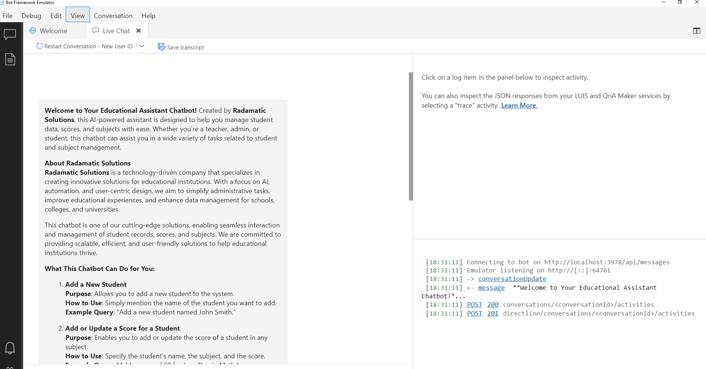

**Welcome to Your Educational Assistant Chatbot!**
Created by **Radamatic Solutions**, this AI-powered assistant is designed to help you manage student data, scores, and subjects with ease. Whether you're a teacher, admin, or student, this chatbot can assist you in a wide variety of tasks related to student and subject management.

**About Radamatic Solutions**  
**Radamatic Solutions** is a technology-driven company that specializes in creating innovative solutions for educational institutions. With a focus on AI, automation, and user-centric design, we aim to simplify administrative tasks, improve educational experiences, and enhance data management for schools, colleges, and universities.

This chatbot is one of our cutting-edge solutions, enabling seamless interaction and management of student records, scores, and subjects. We are committed to providing scalable, efficient, and user-friendly solutions to help educational institutions thrive.

**What This Chatbot Can Do for You:**

1. **Add a New Student**  
   **Purpose**: Allows you to add a new student to the system.  
   **How to Use**: Simply mention the name of the student you want to add.  
   **Example Query**: "Add a new student named John Smith."

2. **Add or Update a Score for a Student**  
   **Purpose**: Enables you to add or update the score of a student in any subject.  
   **How to Use**: Specify the student's name, the subject, and the score.  
   **Example Query**: "Add a score of 90 for Jane Doe in Math."

3. **Add a New Subject**  
   **Purpose**: Lets you add new subjects to the database.  
   **How to Use**: Mention the name of the subject you want to add.  
   **Example Query**: "Add a subject named Biology."

4. **Summarize Scores for a Subject**  
   **Purpose**: Get a summary of all scores or the average score for a particular subject.  
   **How to Use**: Specify the subject for which you need the summary.  
   **Example Query**: "Summarize scores in Physics."

5. **Retrieve Subjects of a Specific Student**  
   **Purpose**: Lists the subjects a particular student is enrolled in.  
   **How to Use**: Mention the student’s name.  
   **Example Query**: "What subjects is John Smith taking?"

6. **Retrieve Details of a Specific Student**  
   **Purpose**: Provides the details of a specific student in the database.  
   **How to Use**: Simply provide the name of the student.  
   **Example Query**: "Retrieve details for Suraj."

7. **List All Students in the Database**  
   **Purpose**: Retrieves the list of all students in the database.  
   **How to Use**: Request the list of all students.  
   **Example Query**: "List all students."

---

**How to Use the Chatbot:**

- **Be Clear and Specific**: The more specific your request is, the better the response. For example, mention the student’s name, subject, and score when adding or updating scores.

This chatbot is brought to you by **Radamatic Solutions**, where we strive to deliver cutting-edge solutions to modern educational challenges.

**Let’s get started! Feel free to ask anything, and let us help you manage your student data effortlessly.** 😊

---

**Instruction for running chatbot:**
Install requirements.txt by this command. pip install -r requirements.txt

**Please note that any other module will also need to install, once you run code you will get module error so install required module by using comamand pip install <module_name>** 😊

**First Step:  run main.py file, its a Fast API file which will host the api to fast uvicor server. command: uvicorn main:app --reload**
**Second Step:  run app.py file, this is bot file.**

---

## Tech Stack Used

- **Python**: The programming language used to build the chatbot's logic.
- **FastAPI**: Framework for building the API that handles bot requests.
- **Microsoft Bot Framework**: Provides the core functionality for developing the chatbot.
- **Microsoft Bot Emulator**: Tool used for testing and debugging the chatbot locally.

---

**Chatbot ScreenShots:**

